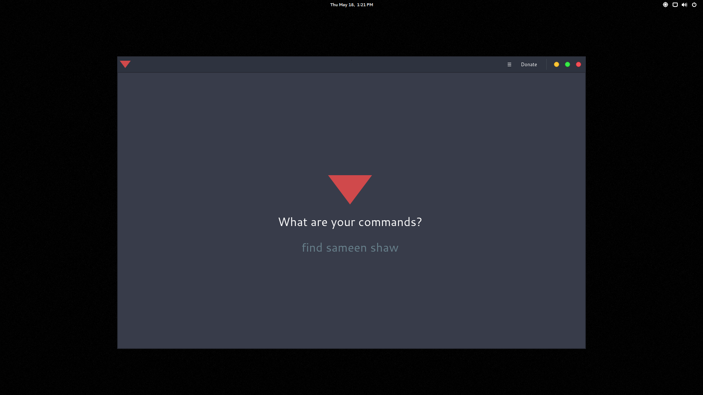

# Research (Work in Progress)

brought to you as libre software with joy and pride by [Artificial Engineering](http://artificial.engineering).

Support our libre Bot Cloud via BTC [1CamMuvrFU1QAMebPoDsL3JrioVDoxezY2](bitcoin:1CamMuvrFU1QAMebPoDsL3JrioVDoxezY2?amount=0.5&label=lychee.js%20Support).


## Overview

Project Research is a tool that helps you understand the internet more
easily and comes with an easy natural language interface. It is not
a stupid assistant, but more of an "internet buddy" to ease up your
web browsing experience and support you as far as possible.




## Features

- does not load Cookies
- does not load Flash
- does not load JS
- does not load CSS
- does not load Advertisements
- does not load iFrames

You have full control over what content is requested. There's even a
`Tethering Mode` that will allow you to _only_ load text content and
will not load images or videos until you say so.

Project Research also saves you bandwidth. By default, it will prefer
the local remembered content and not request anything until you say so.
You have full control about what content is loaded.

It can archive ANY kind of content to a simple shareable offline
archive folder on your hard drive that you can share via USB and reuse
with other Project Research installations on other computers.

It is peer-to-peer and allows sharing your offline archive of websites
with other local instances, so that you don't waste bandwidth on a
shared internet connection.

Under the hood it uses [nw.js](https://nwjs.io) and [lychee.js](https://lychee.js)
and has a zero-unnecessary-dependency philosophy.


## Installation

For now, we don't have ready-to-use binaries. This project is still in
alpha, but soon we may have some ready for you in the
[releases](https://github.com/Artificial-Engineering/research/releases)
section.

Research is a project made with [lychee.js](https://lychee.js.org).

It is automatically built and deployed to GitHub using the following
`lycheejs-fertilizer` integration scripts:

- `bin/build.sh` builds the project
- `bin/package.sh` bundles the project into binaries (`nwjs` platform)
- `bin/publish.sh` publishes the binaries to a new GitHub Release.

----------

## Work-in-Progress (aka not working)

These are the features that are currently work-in-progress and are known
to fail right now. If you want to help building these, you are welcome to
submit an Issue or a Pull Request. We could use any help :)

- Fallback Reader Functionality
- Reddit Plugin
- Imgur Plugin
- Facebook Plugin
- Gfycat Plugin
- Instagram Plugin
- Medium Plugin
- DuckDuckGo Plugin


----------


## Usage / How To Test (for now)

- Have a UNIX machine (Linux, OSX, BSD, whatever)
- Install nw.js SDK on your machine
- Do this in your Terminal:

```bash
git clone https://github.com/Artificial-Engineering/research.git;

cd ./research;

npm install;

# If nw is not in your $PATH, use /path/to/nw binary
nw .;
```


## License

Project Research is released under [GNU GPL 3](./LICENSE_GPL3.txt) license.

